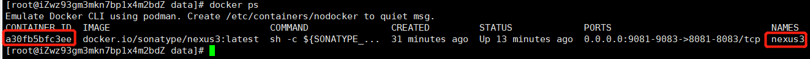

## 安装
```
yum -y install docker
```
* 安装完成即可使用

## 镜像
### 查看已有镜像
```
docker images
```
## 容器
### 查看容器(正在运行)
```
docker ps 
```
* docker ps -a 查看所有容器，包括停止的  

### 启动容器
```
docker start ${container_id} 
```
### 重启容器
```
docker restart ${container_id} 
```
### 停止容器
```
docker stop ${container_id} 
```
### 删除容器
```
docker rm ${container_id} 
```
### 查看日志
```
docker logs ${name|container_id}
```
* 容器id或name都可以
