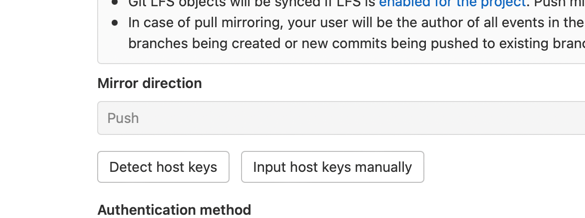

## Mirroring repositories
- 位置：[project name] -> Settings -> Repository:Mirroring repositories
- `Git repository URL`  
填ssh: `ssh://git@github.com/muxianliangqin/qiyue-config.git`  
## **注意**
- github已经不允许通过账号密码方式执行pull/push  
- github ssh：`git@github.com:muxianliangqin/qiyue-config.git`
- gitlab ssh: `ssh://git@github.com/muxianliangqin/qiyue-config.git`  
  - 前缀加 `ssh://`
  - `:` 改 `/`
### ubuntu root账号 [生成ssh密钥](../ssh/index.md)
### [git配置生成的公钥](https://github.com/settings/keys)
### root账号配置
- `cd /root/.ssh/`
- `touch known_hosts`
- `vim known_hosts` 输入 `256 SHA256:xxxx github.com (ECDSA)`

### gitlab Mirroring repositories 选择 `Detect host keys`
