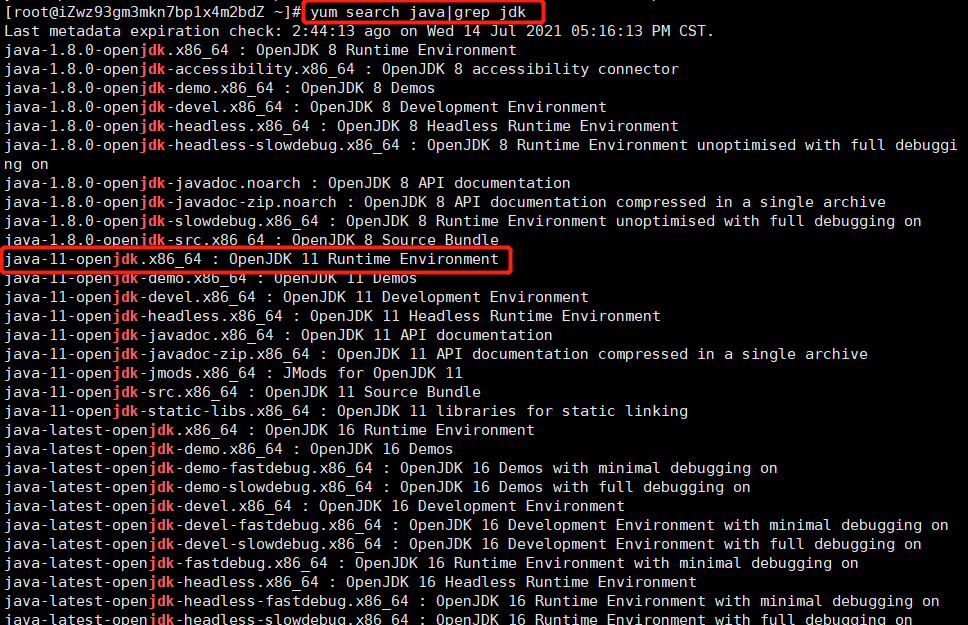
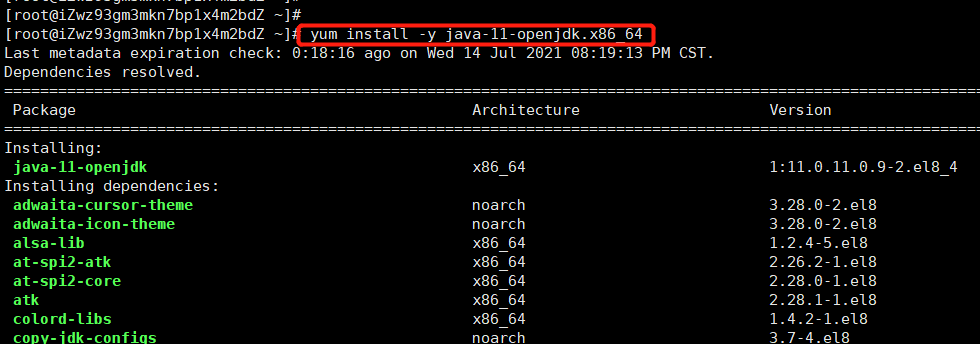
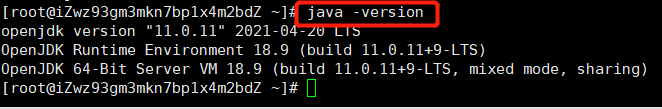

先使用yum搜索jdk可安装版本
```
yum search java|grep jdk
```


选定版本，安装
```
yum install -y java-11-openjdk.x86_64
```
> yum [options] [command] [package ...]
> options：可选，选项包括-h（帮助），-y（当安装过程提示选择全部为"yes"），-q（不显示安装的过程）



等待安装完毕即可。

查看jdk版本
```
java -version
```

