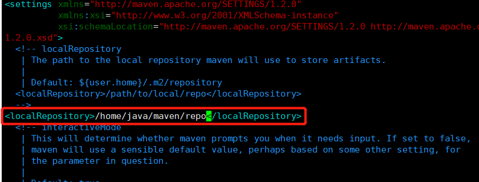

### 下载压缩包
```
wget https://downloads.apache.org/maven/maven-3/3.8.6/binaries/apache-maven-3.8.6-bin.tar.gz
```
可能速度较慢，建议先下载再上传

### 解压
```
tar -zxvf apache-maven-3.8.1-bin.tar.gz
```

### 设置环境变量  
修改profile
```
vim /etc/profile
```
按i进入编辑模式  
在文件最下方输入：
```
export MAVEN_HOME=/home/java/maven/apache-maven-3.8.1
export PATH=$MAVEN_HOME/bin:$PATH
```
按ESC，按 ：，输入wq 再shift保存  
此时会报错
```
E45: 'readonly' option is set (add ! to override)
```
是因为权限不足，切换root账号
```
su root
```
输入root账号密码
重新编辑保存

刷新环境变量
```
source /etc/profile
```
### 查看版本号
```
mvn -version
```
自定义设置本地仓库的目录
```
vim conf/setting.xml
```
编辑设置localRepository  


## ubuntu安装maven
`sudo apt maven`

## maven3.6.3不支持jdk17 
报错： `mvn Unable to load cache item`
### 升级maven
- 如上介绍，官网下载3.8.6版 `wget https://downloads.apache.org/maven/maven-3/3.8.6/binaries/apache-maven-3.8.6-bin.tar.gz`  
解压 `tar -zxvf apache-maven-3.8.6-bin.tar.gz`
- `whereis maven` 得知maven安装目录在 `/usr/share/maven`  
删除 `sudo rm -rf /usr/share/maven`
- 复制文件夹至share `sudo mv xx/apache-maven-3.8.6 /usr/share/maven`
- 查看版本号 `mvn -v`


