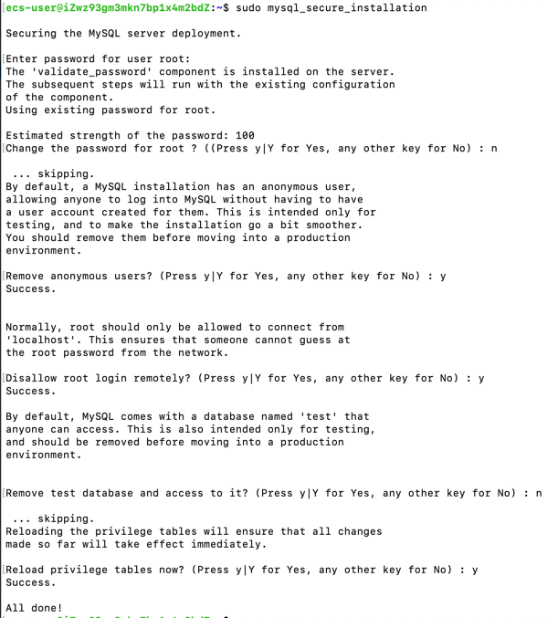

### 安装
`sudo apt install mysql-server`
此时root账号可以无密码访问
`sudo mysql`
- 设置root密码
`ALTER USER 'root'@'localhost' IDENTIFIED WITH mysql_native_password by 'password';`  
- 对数据库进行安全设置 `sudo mysql_secure_installation`
