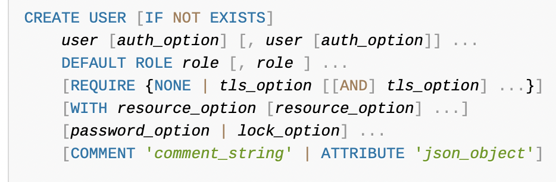

## 创建用户

```
create user test@'%' identified by 'xx';
```
CREATE USER username@'host' IDENTIFIED BY 'password'

## 给用户授权数据库权限
```
GRANT ALL ON test.* TO 'test'@'%';
```
<https://dev.mysql.com/doc/refman/8.0/en/grant.html>

