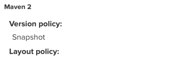

- `status: 405 PUT`  
应该 create repository 选 hosted 类型
- `status: 400 Repository version policy: RELEASE does not allow version: 0.0.1-20220706.160834-1`  
  - 新建repository时应选择version policy为 Snapshot
  - 新建后不可更改，只能删除重建  
