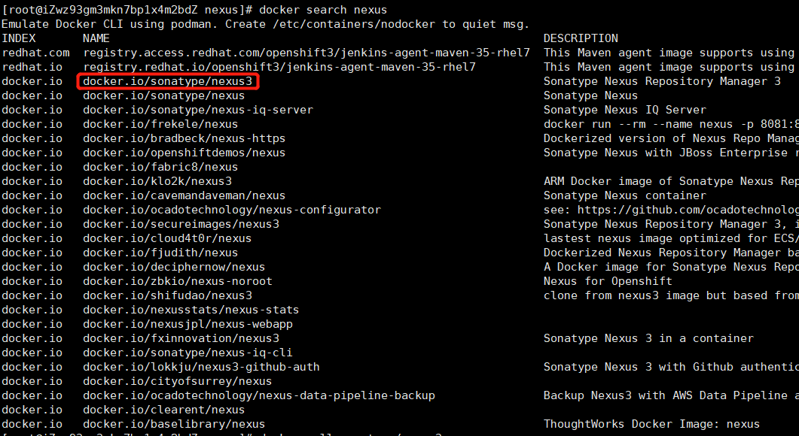
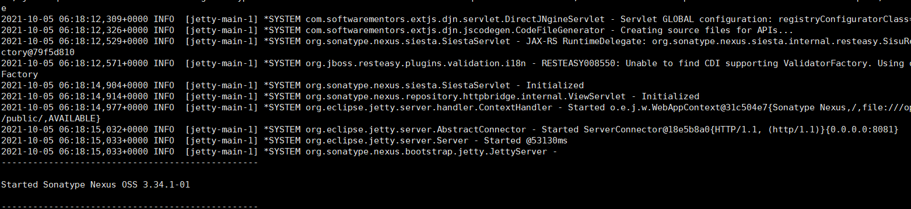

## 通过docker安装nexus

### 搜索镜像
```
sudo docker search nexus
```


### 选择并拉取镜像
```
sudo docker pull docker.io/sonatype/nexus3
```
### 创建挂载目录
```
sudo mkdir /home/nexus/data
```
### 启动nexus时可能会遇到权限的问题，赋予最高权限
```
sudo chmod 777 /home/nexus/data
```
### docker启动
```
sudo docker run -d --name nexus3 -p 9081:8081 -p 9082:8082 -p 9083:8083 -v /home/nexus/data:/nexus-data sonatype/nexus3
```
### 查看日志
```
sudo docker logs nexus3
```
如果查看失败，使用`docker ps -a` 查看容器，使用`docker logs ${container_id}`查看日志

确定启动成功

页面访问 http://127.0.01:9081/ 输入账号：admin，密码： 
* 密码可在 data 目录下 admin.password 文件查看 `more admin.password`
* 切不可在此处修改密码，登录成功后会要求修改admin密码
