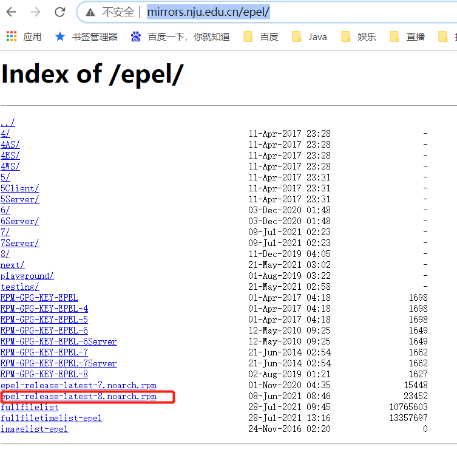

rabbitMQ依赖erlang
## 安装erlang
查看erlang的rpm版本
```
http://mirrors.nju.edu.cn/epel/
```


这里选择最新版
```
rpm -Uvh http://mirrors.nju.edu.cn/epel/epel-release-latest-8.noarch.rpm
```
[rpm学习] : https://www.runoob.com/linux/linux-comm-rpm.html  

错误：
```
error: can't create transaction lock on /var/lib/rpm/.rpm.lock (Permission denied)
```
需要使用root用户安装

yum也需要超级用户权限
```
This command has to be run with superuser privileges (under the root user on most systems).
```
切换root用户，执行命令
```
yum install erlang
```
确认并等待安装完成  
检查erlang是否安装成功
```
erl
```

## 安装rabbitMQ 
安装教程  
通过下载rpm方式安装
```
https://www.rabbitmq.com/install-rpm.html#downloads
```
选择对应系统的下载
```
wget https://github.com/rabbitmq/rabbitmq-server/releases/download/v3.9.5/rabbitmq-server-3.9.5-1.el8.noarch.rpm
```
可能报错
```
Error: 
 Problem: conflicting requests
  - nothing provides erlang >= 23.2 needed by rabbitmq-server-3.9.5-1.el8.noarch
(try to add '--skip-broken' to skip uninstallable packages or '--nobest' to use not only best candidate packages)
```
erlang和rabbitmq的版本不对应，这里要么选择升级erlang，要么选择安装对应版本的rabbitmq  
版本对应关系查看
```
https://www.rabbitmq.com/which-erlang.html
```
rabbitmq的历史版本下载，选择可用版本
```
https://github.com/rabbitmq/rabbitmq-server/releases
```
下载后，安装
```
yum install rabbitmq-server-3.8.8-1.el6.noarch.rpm
```
选择 y 确认，安装完成

#### 以守护程序启动rabbitmq
配置rabbitmq-serve为守护程序
```
chkconfig rabbitmq-server on
```
####启动
```
/sbin/service rabbitmq-server start
```
#### 启动成功 
```
Starting rabbitmq-server (via systemctl):                  [  OK  ]
```
####查看状态
```
/sbin/service rabbitmq-server status
```
####关闭
```
/sbin/service rabbitmq-server stop
```
#### 重启
```
/sbin/service rabbitmq-server restart
```
- 详情请见rabbit官网 `https://www.rabbitmq.com/install-rpm.html`
